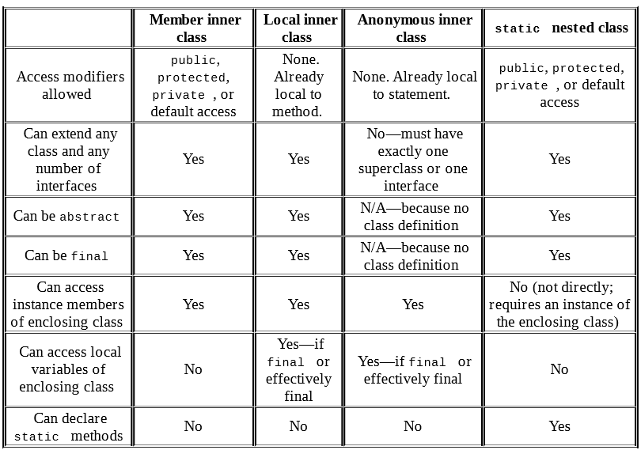

Types:

1. A member inner class is a class defined at the same level as instance 
variables. It is not static. Often, this is just referred to as an 
inner class without explicitly saying the type. 

2. A local inner class is defined within a method.

3. An anonymous inner class is a special case of a local inner class 
that does not have a name.

4. A static nested class is a static class that is defined at the same 
level as static variables.

Inner class:

1. Can be declared public, private, or protected or use default access 
2. Can extend any class and implement interfaces
3. Can be abstract or final
4. Cannot declare static fields or methods 
5. Can access members of the outer class including private members

You also aren’t limited to just one inner class. 

Local Inner class:

1. They do not have an access specifier.
2. They cannot be declared static and cannot declare static 
fields or methods
3. They have access to all fields and methods of the enclosing class.
4. They do not have access to local variables of a method unless 
those variables are final or effectively final. More on this shortly. 

Static Nested Class:

1. The nesting creates a namespace because the enclosing class name 
must be used to refer to it. 
2. It can be made private or use one of the other access modifiers 
to encapsulate it. 
3. The enclosing class can refer to the fields and methods of 
the static nested class.

