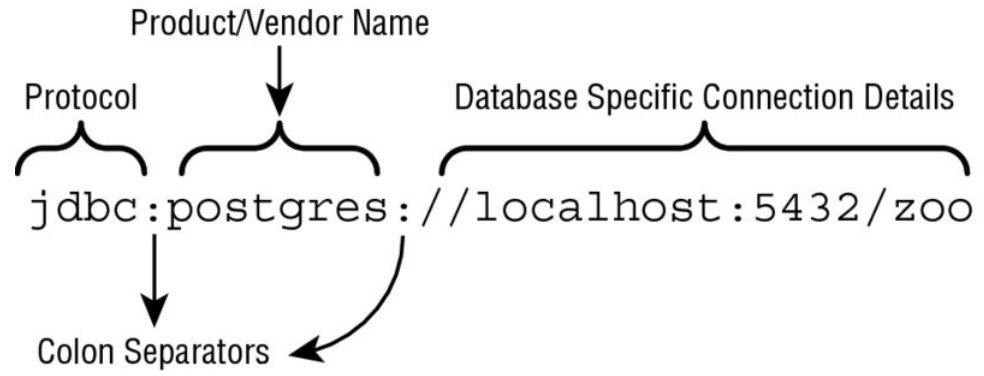
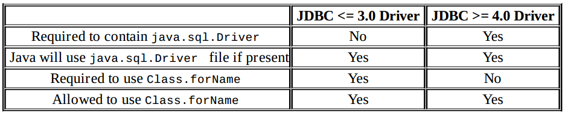
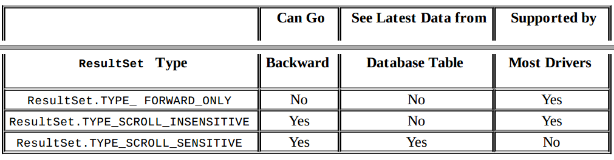
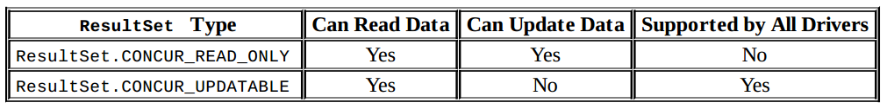
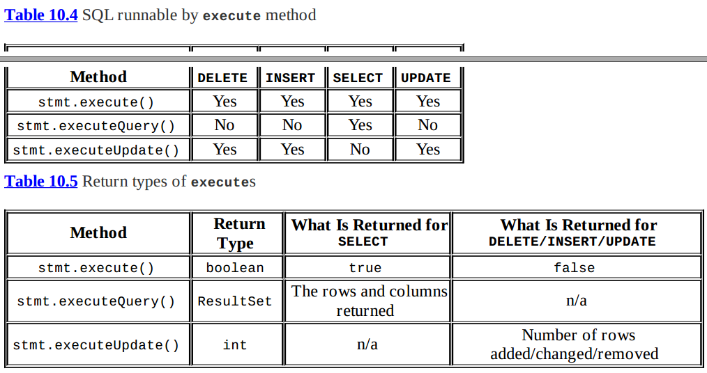
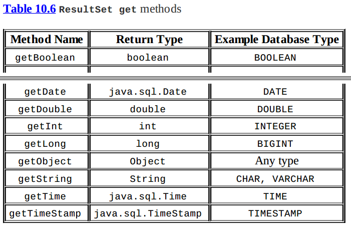
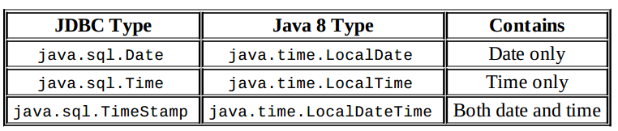
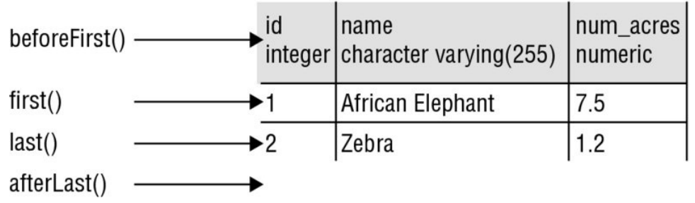
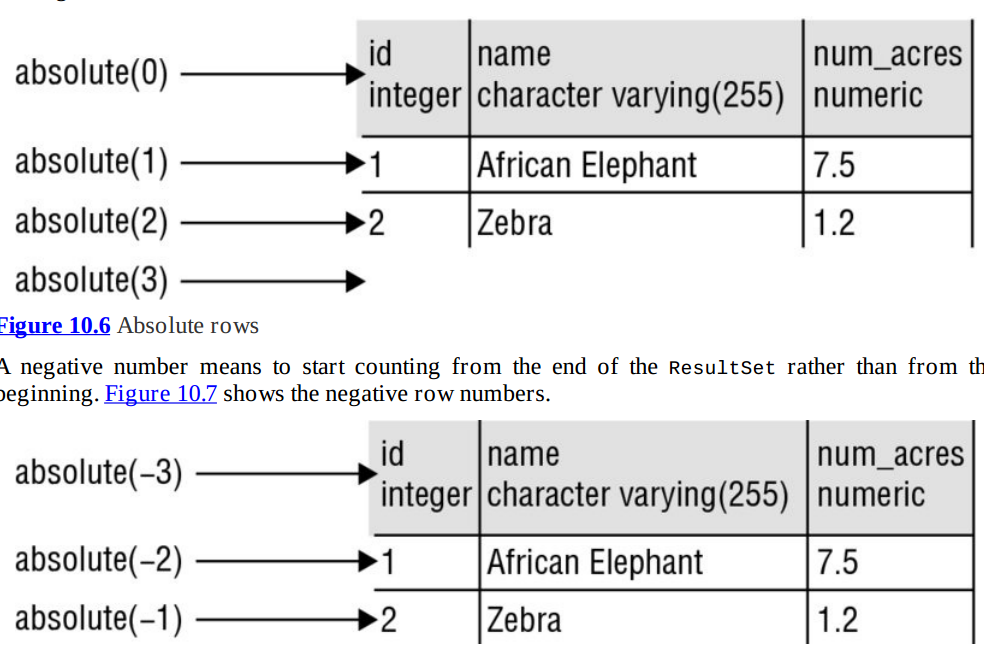

Examples:
```
jdbc:derby:zoo

jdbc:postgresql://localhost/zoo
jdbc:oracle:thin:@123.123.123.123:1521:zoo
jdbc:mysql://localhost:3306/zoo?profileSQL=true
```






```
PreparedStatement ps = conn.prepareStatement("delete from animal where name = ?");
ps.setString(1, name);
ps.execute();
```
performance, security, and readability





```
java.sql.Time sqlTime = rs.getTime(1);
LocalTime localTime = sqlTime.toLocalTime();

java.sql.Timestamp sqlTimeStamp = rs.getTimestamp(1);
LocalDateTime localDateTime = sqlTimeStamp.toLocalDateTime();
```





