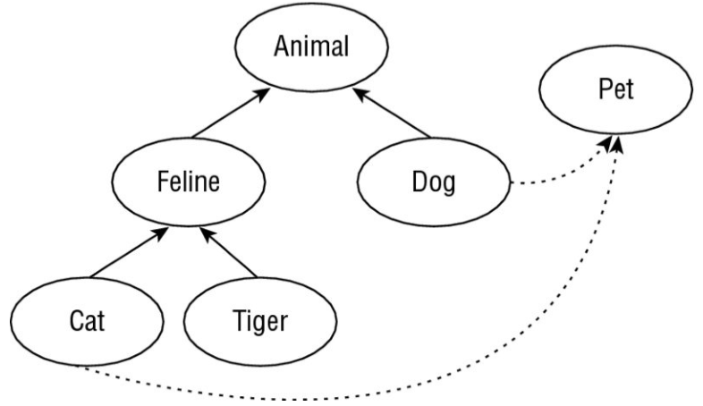
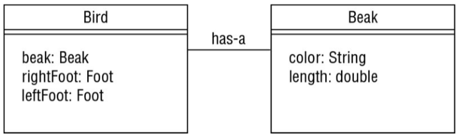

In general, following good design principles leads to

1. More logical code
2. Code that is easier to understand
3. Classes that are easier to reuse in other relationships and applications 
4. Code that is	easier to maintain and that adapts more readily 
to changes in the application requirements

 In software development, a data model is the representation of our 
 objects and their properties within our application and how they 
 relate to items in the real world.

A JavaBean is a design principle for encapsulating data in an object in Java.
JavaBean naming conventions:
1. properties are private
2. getter for non-boolean properties begins with get
3. getters for boolean properties may begin with is or get
4. Setter methods begin with set
5. The method name must have a prefix of set/get/is followed by the 
first letter of property in uppercase and followed by the rest of the
property name.

IS-A relationship - inheritance test
i.e. A is-a B means B is a parent for A

HAS-A relationship - object composition test

