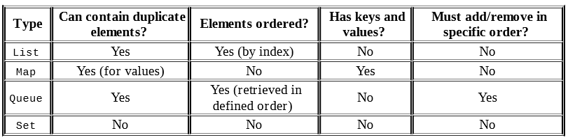
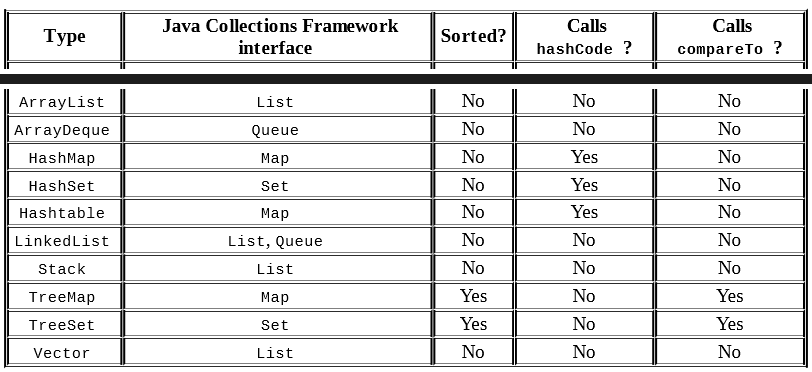

Java Collection Framework:

1. List: A list is an ordered collection of elements that allows 
duplicate entries. Elements in a list can be accessed by an int index.
2. Set: A set is a collection that does not allow duplicate entries.
3. Queue: A queue is a collection that orders its elements in a specific 
order for processing. A typical queue processes its elements in a 
first-in, first-out order, but other orderings are possible. 
4. Map: A map is a collection that maps keys to values, with no 
duplicate keys allowed. The elements in a map are key/value pairs.

#Collection methods:

- add
- remove
- isEmpty
- size
- clear
- contains

#Performance of Algorithms:

- O(1)—constant time: It doesn’t matter how large the collection is, 
the answer will always take the same time to return. Returning the 
string literal “Panda” from a method will take constant time, as will 
returning the last element of an array. 
- O(log n)—logarithmic time: A logarithm is a mathematical function 
that grows much more slowly than the data size. You don’t need to 
know this for the exam, but log(8) gives you 3 in base 2 and log(1024) 
gives you 10 in base 2. The point is that logarithmic time is better 
than linear time. Binary search runs in logarithmic time because it 
doesn’t look at the majority of the elements for large collections. 
- O(n)—linear time: The performance will grow linearly with respect 
to the size of the collection. Looping through a list and returning 
the number of elements matching “Panda” will take linear time. 
- O(n2)—n squared time: Code that has nested loops where each loop 
goes through the data takes n squared time. An example would be 
putting every pair of pandas together to see if they’ll share an exhibit. 

