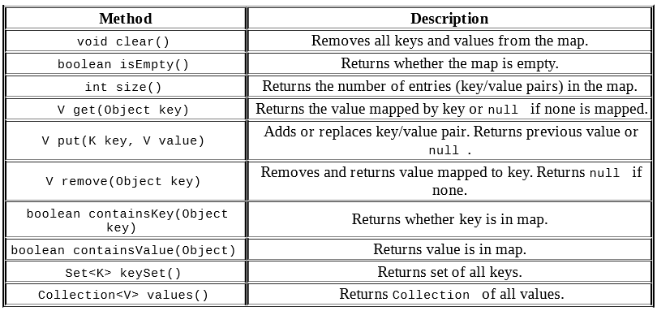

#Map

Identify values by a key

##HashMap

A HashMap stores the keys in a hash table. This means that it uses 
the hashCode() method of the keys to retrieve their values more 
efficiently.

The main benefit is that adding elements and retrieving the element 
by key both have constant time. The tradeoff is that you lose the 
order in which you inserted the elements. Most of the time, you 
aren’t concerned with this in a map anyway. If you were, you could 
use LinkedHashMap.

##TreeMap

A TreeMap stores the keys in a sorted tree structure. The main 
benefit is that the keys are always in sorted order. The tradeoff 
is that adding and checking if a key is present are both O(log n).

