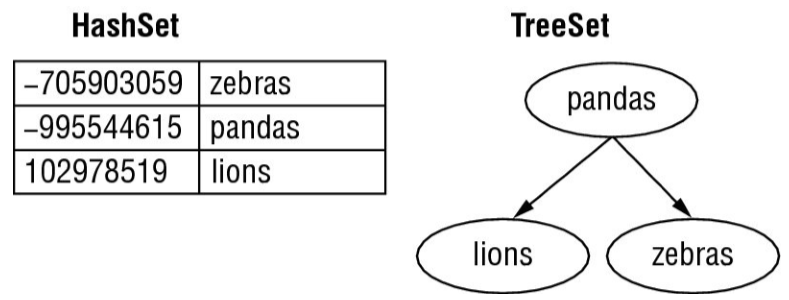
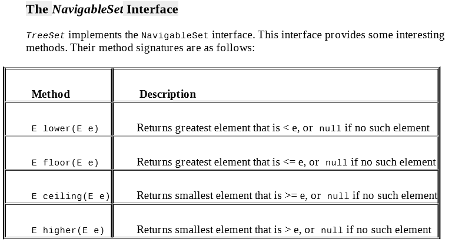

#Set:

A Set is a Collection that cannot contain duplicate elements. 
It models the mathematical set abstraction.

The Set interface contains only methods inherited from Collection 
and adds the restriction that duplicate elements are prohibited.

Set also adds a stronger contract on the behavior of the equals 
and hashCode operations, allowing Set instances to be compared 
meaningfully even if their implementation types differ.

##HashSet:

HashSet extends AbstractSet and implements the Set interface. 
It creates a collection that uses a hash table (HashMap) for storage.

The main benefit is that adding elements and checking if an element 
is in the set both have constant time. The tradeoff is that you lose 
the order in which you inserted the elements.

##TreeSet:
TreeSet provides an implementation of the Set interface that uses 
a tree for storage. Objects are stored in sorted, ascending order.

The main benefit is that the set is always in sorted order. 
The tradeoff is that adding and checking if an element is present 
are both O(log n).

