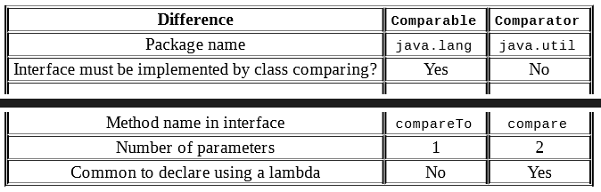

##compareTo() rules:

1. The number zero is returned when the current object is equal to 
the argument to compareTo().

2. A number less than zero is returned when the current object is 
smaller than the argument to compareTo().

3. A number greater than zero is returned when the current object 
is larger than the argument to compareTo().

