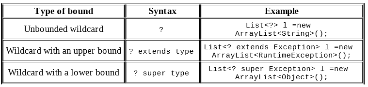

#Naming Conventions for Generics

- E for an element
- K for a map key
- V for a map value
- N for a number
- T for a generic data type
- S,U,V, and so forth for multiple generic types

#Generics limitation:

- Call the constructor. new T() is not allowed because at runtime it would be new Object().
- Create an array of that static type. This one is the most annoying, but it makes sense because you’d be creating an array of Objects. 
- Call instanceof. This is not allowed because at runtime List<Integer> and List<String> look the same to Java thanks to type erasure. 
- Use a primitive type as a generic type parameter. This isn’t a big deal because you can use the wrapper class instead. If you want a type of int, just use Integer.
- Create a static variable as a generic type parameter. This is not allowed because the type is linked to the instance of the class.

##Collections written without generics are also known as raw collections

This command will show unsafe operations with raw collections:
javac -Xlint:unchecked *.java

