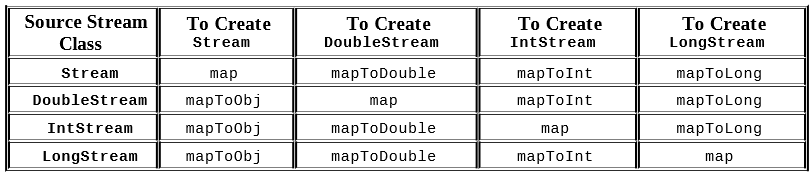
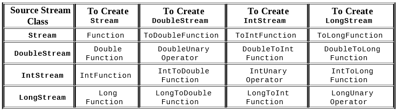
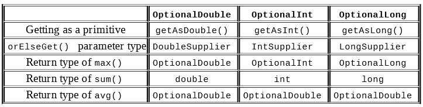
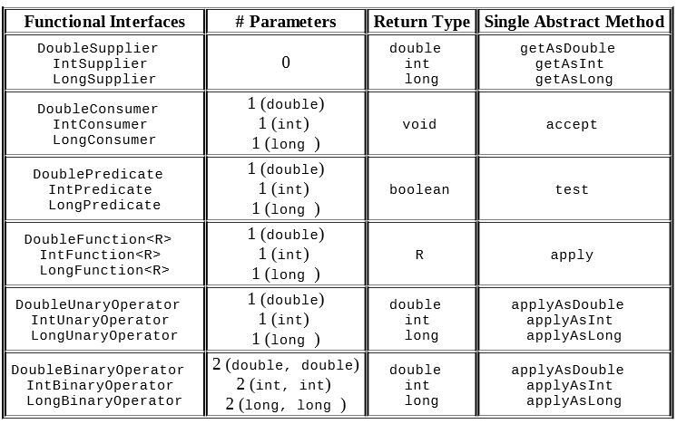
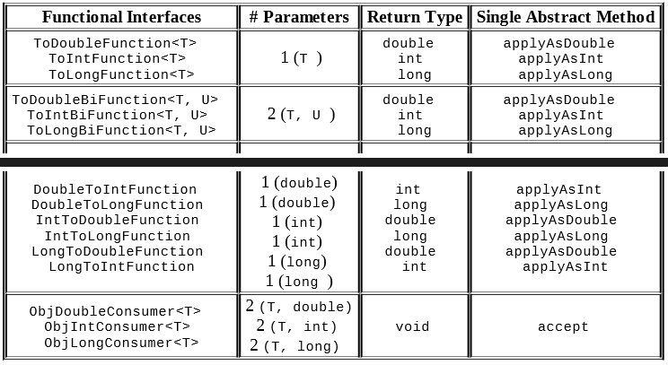
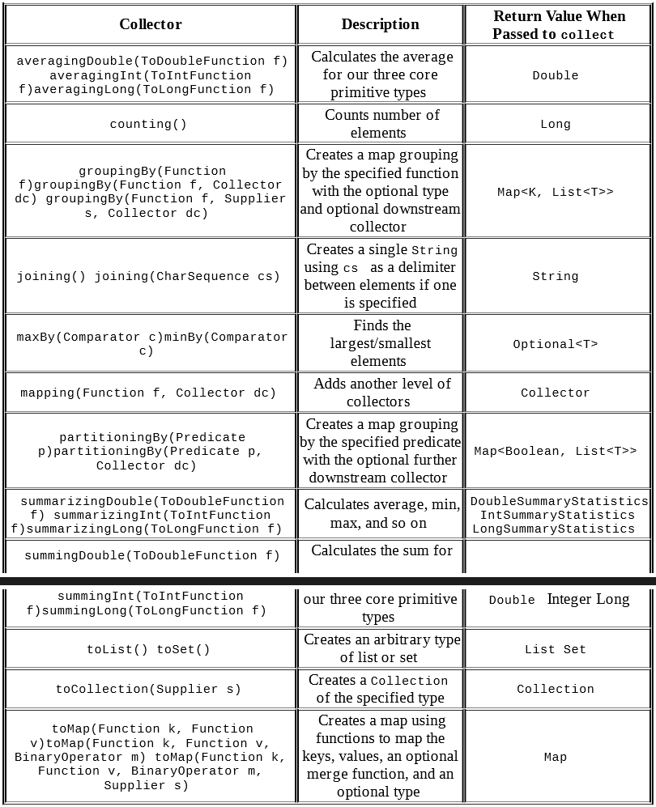

#Using Streams

##Stream

A stream in Java is a sequence of data

## Stream Pipeline

A stream pipeline is the operations that run on a stream to produce a result.

##Stream Operations:

1. Source: Where the stream comes from.

2. Intermediate operations: Transforms the stream into another one. 
There can be as few or as many intermediate operations as you’d like. 
Since streams use lazy evaluation, the intermediate operations do 
not run until the terminal operation runs.

3. Terminal operation: Actually produces a result. Since streams can 
be used only once, the stream is no longer valid after a terminal 
operation completes.

Primitive Streams:

1. IntStream: used for primitive types int, short, byte, char
2. LongStream: used for the primitive type long
3. DoubleStream: used for the primitive types double and float

