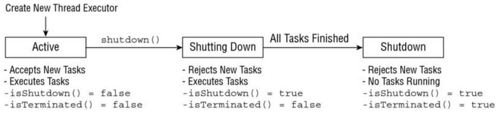
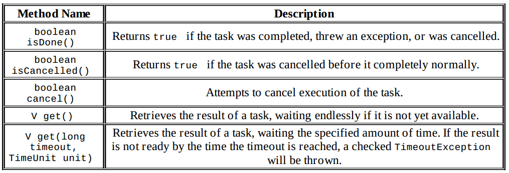
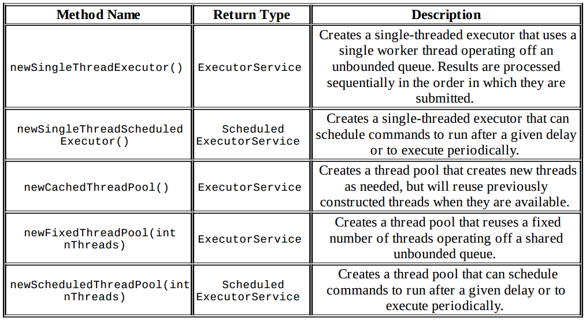
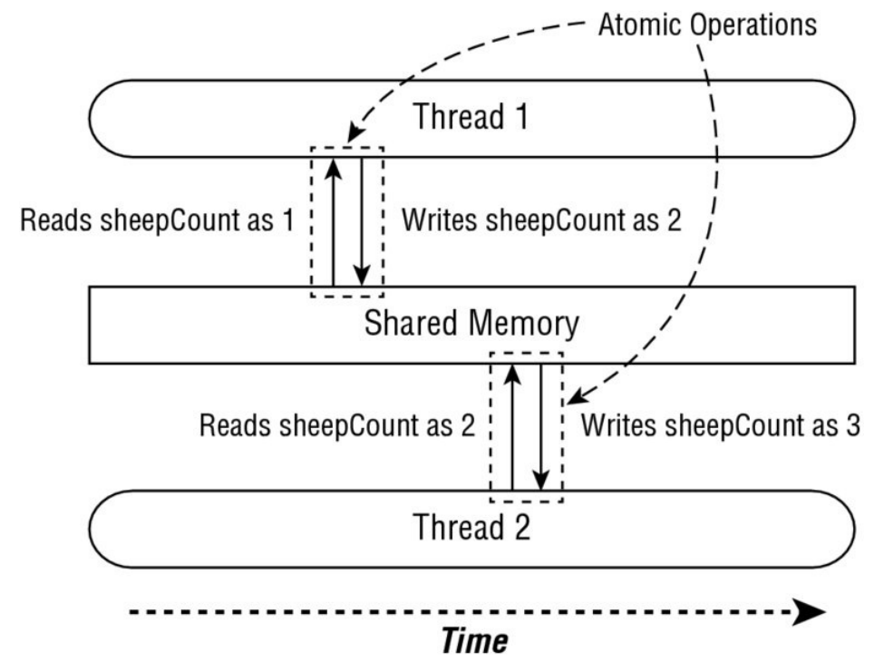

You should be aware that shutdown() does not actually stop any tasks that have already been submitted to the thread executor.

#thread pool 
is a group of pre-instantiated reusable threads that are available to perform a set of arbitrary tasks.

