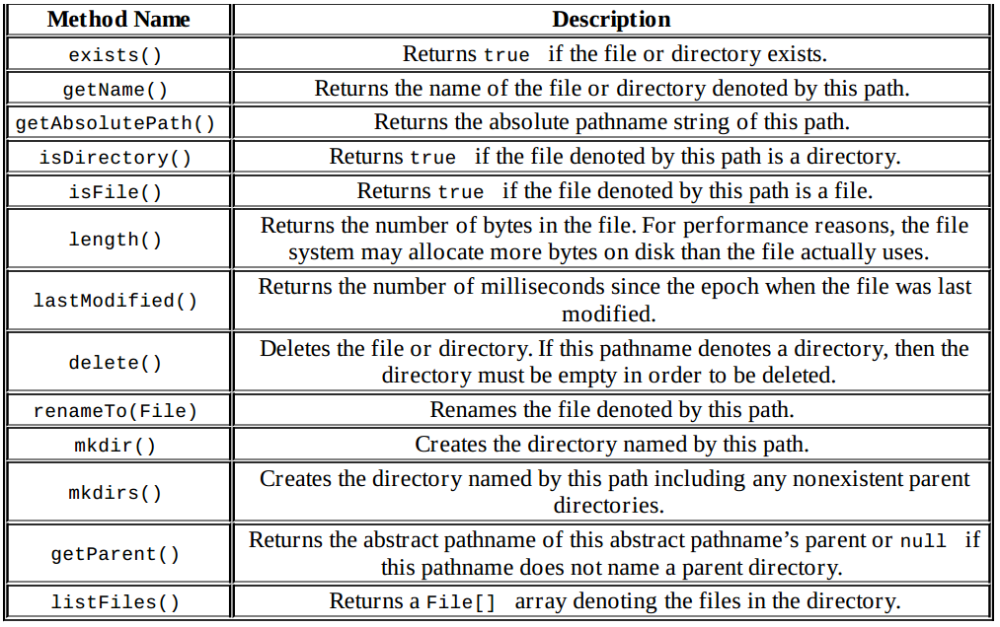
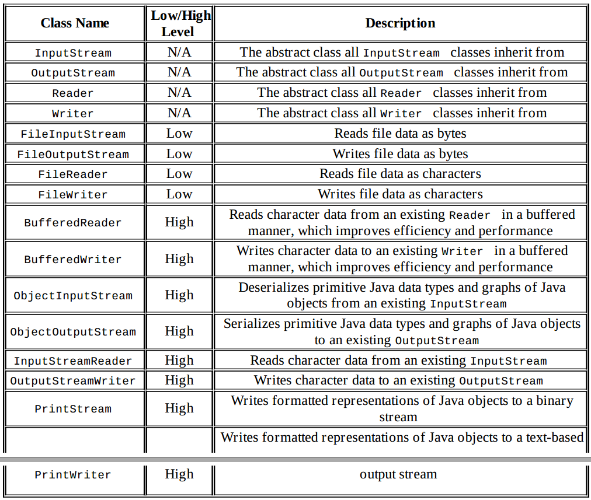

An instance of a File class represents the pathname of a particular file or directory on the file system.
The File class cannot read or write data within a file, although it can be passed as a reference to
many stream classes to read or write data, as you shall see in the next section.

Differences between Streams and Readers/Writers
1. The stream classes are used for inputting and outputting all types of binary or byte data.
2. The reader and writer classes are used for inputting and outputting only character and String data.

Review of java.io Class Properties

- A class with the word InputStream or OutputStream in its name is used for reading or writing
binary data, respectively.
- A class with the word Reader or Writer in its name is used for reading or writing character or
string data, respectively.
Most, but not all, input classes have a corresponding output class.
- A low-level stream connects directly with the source of the data.
- A high-level stream is built on top of another stream using wrapping.
- A class with Buffered in its name reads or writes data in groups of bytes or characters and often
improves performance in sequential file systems.

